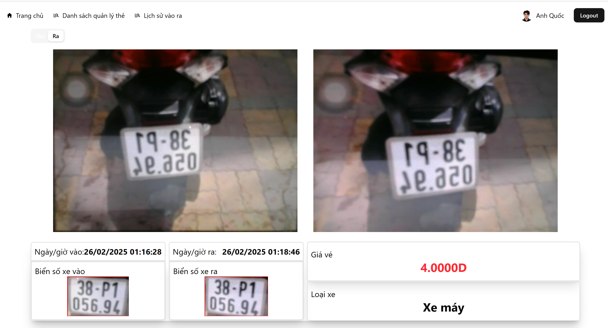

# Go-Parking-Lot

### Swagger-UI

### Features :

1. Authentication and Authorization (SignIn - SignUp)
2. Manage Card (CRUD Card)
3. Manage IOHistory (CRUD IOHistory)
4. Check Entrance - Exit (RFID)

## Demo (Youtube)

## How to run application with Docker (Recommend)

1. Clone the repo and cd into it
2. Set mode `LF` (not `CRLF`) for entrypoint.sh file
3. Copy `.example.env` (not `app.example.env`) file to `.env` file and update your `env variables`
4. Run `docker-compose -f docker-compose-developer.yml up --build -d` local dev environment
5. Setup minio container.

- Run `docker exec -it <container_id of parking.minio> sh`.
- Run `mc alias set myminio http://parking.minio:9000 minioadmin minioadmin123`.
- Run `mc anonymous set public myminio/goparking`.

6. Visit `http://localhost:8005` on browser.

### Tech Stack :

- Restful API
- GRPC
- Gin-gonic
- Gorm
- Swagger
- Logging
- Jwt-Go
- Gin-gonic
- Docker
- Nginx
- Postgres
- Minio
- RFID

## Author Contact

Contact me with any questions! 

Email: anquoc18092003@gmail.com
Facebook: https://www.facebook.com/tranphuocanhquoc2003

Thank You so much for your time !!!

